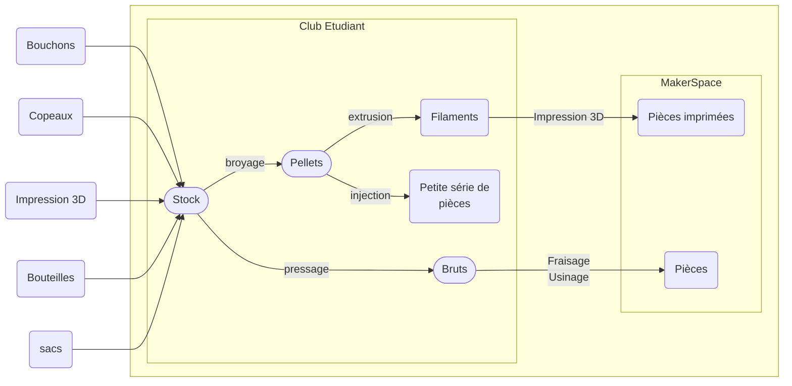

## 1. Présentation : 

Aujourd’hui, un grand nombre de plastiques sont recyclables et peuvent permettre, après re-transformation, la création de nouveaux objets sans avoir à extraire des nouvelles matières premières. 

Si ces transformations étaient auparavant réservées à l’industrie, l’arrivée de machines libres dans la communauté makers et la démocratisation du “Faire soi-même” (D.I.Y - Do It Yourself) au travers des makerspace, FabLab et hackerspace, a permis de rendre accessible la revalorisation des matières plastiques. 

Des communautés ont alors émergé, prônant la revalorisation des déchets plastiques à une échelle locale et créant des ateliers et des machines dédiées à ces usages. La communauté "[Precious plastic](https://preciousplastic.com)" en est un exemple puisque ses membres ont non seulement créé des machines dédiées au recyclage DIY mais réalisés une documentation très riche dans la manière de mettre en place ce type de recyclage. 

Car si aujourd’hui, la prise de conscience des possibilités de recyclage du plastique a majoritairement été acceptée, elle se cantonne trop souvent au choix de la poubelle dans laquelle jeter ses déchets ou à la collecte de bouchons.   

Les objectifs de ce projet au sein d’UniLaSalle Amiens sont donc multiples : 

* Sensibiliser les générations à la revalorisation locale des matériaux 
*Etablir une mini chaine de revalorisation du plastique au sein de l’établissement 
* Utiliser les fruits de ces revalorisations au sein des projets d’école 

## 2. Quels sont les matériaux ciblés ?

Si l’ensemble des matières peuvent être plus ou moins bien recyclées, on se concentrera principalement dans un premier temps sur des sources de plastiques demandant peu de transformation et pouvant être facilement ré-utilisés avec une chaine simple de fabrication, à savoir : 

**Les PE [(Polyéthylène)](https://fr.wikipedia.org/wiki/Polyéthylène) :** C’est la famille de thermoplastiques la plus utilisée au monde et celle que l’on retrouve le plus donc dans nos produits courants. On le retrouve dans plus de la moitié des objets courants et peut être repéré par les symboles suivants :  

* Les principales applications du HDPE sont des produits rigides : flacons (détergents, cosmétiques, etc.), bouteilles, boîtes type Tupperware, jerricans, réservoirs de carburant d'automobiles, etc. 
* Les principales applications du LDPE sont des produits souples : sacs, films, sachets, sacs poubelles, ruban adhésif, récipients souples (ketchup, crèmes hydratantes, etc.), etc. 

**Les PLA [(Acide polylactique)](https://fr.wikipedia.org/wiki/Acide_polylactique) :** Les PLA sont les thermoplastiques les plus utilisés en impression 3D. Ils sont donc très présents dans notre école car un nombre important de prototypes sont produits grâce aux imprimantes 3D. 
Seulement, son usage étant fortement lié au concept de prototypage, les pièces réalisées ont une durée de vie très courte et sont très souvent peu ou pas utilisés (erreur d’impression, fin d’un projet, itération de versions en phase de recherche,…) 
Il est alors intéressant de se pencher sur ce matériau afin de pouvoir le réutiliser dans d’autres productions.



## 3. Fonctionnement de la chaine de revalorisation

La chaine de revalorisation va permettre de transformer des objets plastiques en deux types de matière premières :
- **Les bruts** : plaques, cylindre, blocs... Le plastiques est chauffé puis comprimé dans une forme brutes qui pourra par la suite être usiné, fraisé, percé, poncé... Les copeaux générés peuvent même être gardé pour être refondus et ré-utilisé plus tard.
- **Les pellets** : Le plastique est déchiqueté en petits morceaux afin d'être par la suite chauffé puis injecté. On peut réaliser des mélanges de pellets et créer rapidement des petites séries en moulage par injection. On peut également extruder le plastique afin d'en créer des bobines.

Ces matières brutes peuvent par la suite être utilisées de divers manières afin de créer de nouvelles pièces de prototypage.

## 4. Quels sont les réalisations possibles ?

Ci-dessous une liste de quelques exemples de réalisations qui pourraient être effectuées par cette chaine de revalorisation. 

Outre ces exemples, les possibilités qu'offrent le recyclage des plastiques sont nombreuses à partir du moment ou les matériaux bruts sont exploitables par les machines de l'école. C'est pour cela que le MakerSpace du Campus sera parti prenante du projet en permettant aux étudiants de travailler dans des conditions de sécurités suffisantes et de mettre en conformité les bruts réalisés avec les machines du MakerSpace.

### Exemples :

{% include step-tuto.html 
content="**Recyclage des bouchons**

Les bouchons en plastiques sont en grande partie réalisés à base de PE. Il est possible de les faire fondre et d'en réaliser des plaques ou des pains de matière facilement usinable par la suite. A partir de cette matière première, on peut utiliser des fraiseuses, des machines de tournages et des outils traditionnels pour réaliser d'autres objets.
Les copeaux générés peuvent même être gardés pour être refondus et ré-utilisé plus tard." 
video="-igxhoGEQFU" %}

---



---



---



## 5. Les machines et process nécessaires


---

---

---

---

---


## 6. Fonctionnement 

  <i class="fas fa-hard-hat fa-2x"></i>

... En cours d'écriture ... 

## 7. Budget prévisionnel de dépenses

| **Références** | **Descriptions** | **Total TTC** |
|-----------|-------------|-----------|
| Kit Holipress | Presse à injecter HoliPress et Broyeuse | 4 300,00 € |
| Presse | Presse à chaud | 1 100,00 € |
| Filtre | Système de filtration des fumées | 2 000,00 € |
| Composer 450 | Fileuse / extrudeuse de filament | 7 200,00 € |
| Outillage | - | 3 000,00 € |
| Mobilier | - | 4 000,00 € |
| **Total :** :|| 21 600,00 € |

## Liens et ressources :

- [Precious plastic](https://preciousplastic.com)
- [Polyéthylène](https://fr.wikipedia.org/wiki/Polyéthylène)
- [Acide polylactique](https://fr.wikipedia.org/wiki/Acide_polylactique)
- [Toupie en masques recyclés](https://youtu.be/YVsd3XBJ6i4)
- [Réaliser des plaques de HDPE - Brothers Make](https://youtu.be/xPGunwTUMSE)
- [Réaliser des stylos recyclés - Brothers Make](https://youtu.be/-igxhoGEQFU)
- [Extruding PLA Filament at Home - CNC Kitchen](https://www.youtube.com/watch?v=iRGTwhGRP1Y)
- [Recycling all my 3DBenchys into new Filament - CNC Kitchen](https://www.youtube.com/watch?v=Dwlr2yKlq6w)
- [Holimaker](https://holimaker.fr)